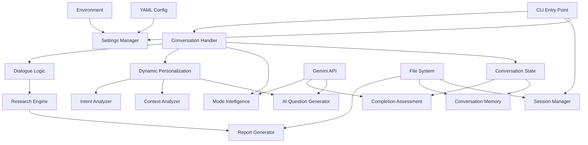
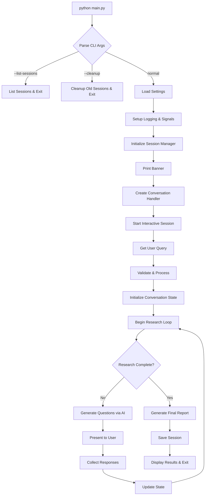
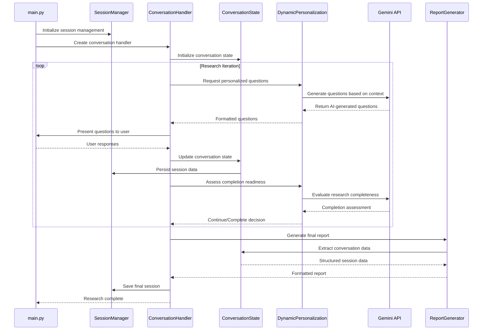

## 1 Project Snapshot

**One-sentence elevator pitch:** AI-powered decision support system that conducts multi-stage iterative research through conversational interactions, using Google's Gemini API to generate personalized questions and assess user responses.

**Tech stack & major third-party deps:**
- Python 3.13+ with asyncio support
- Google Generative AI (Gemini) API
- PyYAML for configuration management
- Pathlib for file system operations
- Dataclasses for structured data
- Pytest for testing infrastructure

**Directory & module map:**
```
702_gemini_deep_research/
├── main.py                           # CLI entry point
├── config/
│   ├── settings.py                   # Configuration management
│   └── settings.yaml                 # Default config values
├── core/                             # Core business logic
│   ├── conversation.py               # Main conversation orchestrator
│   ├── conversation_state.py         # State management & data models
│   ├── conversation_mode_intelligence.py # Mode detection & intelligence
│   ├── dynamic_personalization.py   # AI-driven question generation
│   ├── ai_question_generator.py     # Question generation logic
│   ├── completion_assessment.py     # Research completion analysis
│   ├── context_analyzer.py          # Context analysis utilities
│   ├── dialogue_logic.py            # Conversation flow control
│   ├── intent_analyzer.py           # User intent classification
│   ├── conversation_memory.py       # Session memory management
│   ├── research_engine.py           # Research orchestration
│   └── report_generator.py          # Final report creation
├── utils/
│   ├── session_manager.py           # Session persistence & cleanup
│   └── validators.py                # Input validation utilities
├── tests/                           # Comprehensive test suite
├── data/                            # Runtime data storage
│   ├── sessions/                    # Session persistence
│   ├── reports/                     # Generated reports
│   └── user_preferences/            # User preference cache
└── docs/                            # Project documentation
```

## 2 Architectural Overview



**Data-flow narrative:**
1. User query enters via CLI → Settings validation → Session initialization
2. Conversation Handler orchestrates multi-stage research process
3. Mode Intelligence analyzes conversation context and determines appropriate interaction style
4. Dynamic Personalization generates AI-powered follow-up questions via Gemini API
5. User responses accumulate in Conversation State with memory persistence
6. Completion Assessment evaluates research completeness using AI analysis
7. Report Generator synthesizes findings into structured output
8. Session Manager handles persistence, cleanup, and state recovery

**Key design patterns:**
- **State Machine**: ConversationState manages research progression through defined stages
- **Strategy Pattern**: Multiple conversation modes (EXPLORATORY, DECISIVE, COMPREHENSIVE)
- **Observer Pattern**: Session management with signal handlers for graceful shutdown
- **Factory Pattern**: Dynamic question generation based on context and user profile
- **Repository Pattern**: Session persistence with file-based storage

## 3 Execution Flow Diagrams

### Main Application Flow


### Cross-Module Interaction Sequence


## 4 Pseudocode

### Core Application Entry Point (`main.py`)
```
FUNCTION main():
    args = parse_command_line_arguments()
    setup_signal_handlers_for_graceful_shutdown()
    
    settings = load_configuration(args.config, args.env)
    setup_logging(settings.log_level)
    session_manager = initialize_session_manager(settings)
    
    IF args.list_sessions:
        display_session_list(session_manager.list_sessions())
        RETURN 0
    
    IF args.cleanup:
        count = session_manager.cleanup_old_sessions(args.cleanup)
        print_cleanup_summary(count)
        RETURN 0
    
    print_application_banner(settings)
    conversation = create_conversation_handler(settings)
    conversation.start_interactive_session()
    RETURN 0
```

### Conversation Handler (`core/conversation.py`)
```
CLASS ConversationHandler:
    FUNCTION start_interactive_session():
        query = get_user_input_with_validation()
        confirmation = confirm_research_intent(query)
        IF NOT confirmation: RETURN
        
        personalization_enabled = ask_personalization_preference()
        session_id = session_manager.create_session(query)
        state = initialize_conversation_state(query, session_id)
        
        set_signal_handler_context(session_manager, session_id)
        
        WHILE NOT research_complete:
            questions = generate_personalized_questions(state)
            responses = collect_user_responses(questions)
            update_conversation_state(state, responses)
            
            completion_score = assess_research_completeness(state)
            IF completion_score >= confidence_threshold:
                research_complete = TRUE
        
        report = generate_final_report(state)
        display_report_and_save_session(report, state)
```

### Dynamic Personalization Engine (`core/dynamic_personalization.py`)
```
CLASS DynamicPersonalizationEngine:
    FUNCTION generate_questions(state, max_questions):
        context = extract_conversation_context(state)
        user_profile = build_user_profile(state.qa_history)
        conversation_mode = determine_conversation_mode(state)
        
        prompt = construct_ai_prompt(context, user_profile, conversation_mode)
        
        TRY:
            ai_response = call_gemini_api(prompt)
            questions = parse_and_validate_questions(ai_response)
            RETURN filter_and_rank_questions(questions, max_questions)
        CATCH api_error:
            RETURN generate_fallback_questions(context)
    
    FUNCTION assess_completion(state):
        conversation_summary = summarize_conversation(state)
        confidence_prompt = build_completion_assessment_prompt(summary)
        
        ai_assessment = call_gemini_api(confidence_prompt)
        confidence_score = extract_confidence_score(ai_assessment)
        RETURN confidence_score
```

### Session Manager (`utils/session_manager.py`)
```
CLASS SessionManager:
    FUNCTION create_session(query):
        session_id = generate_unique_session_id()
        session_data = initialize_session_structure(query, session_id)
        
        session_file = construct_session_file_path(session_id)
        save_session_data(session_file, session_data)
        RETURN session_id
    
    FUNCTION cleanup_incomplete_sessions():
        all_sessions = list_all_session_files()
        FOR session_file IN all_sessions:
            session_data = load_session_data(session_file)
            IF session_data.status == "in_progress":
                age = calculate_session_age(session_data.created_at)
                IF age > max_incomplete_age:
                    mark_session_as_interrupted(session_file)
    
    FUNCTION cleanup_old_sessions(max_days):
        deletion_count = 0
        FOR session_file IN list_all_session_files():
            IF calculate_session_age(session_file) > max_days:
                delete_session_file(session_file)
                deletion_count += 1
        RETURN deletion_count
```

### Conversation State Management (`core/conversation_state.py`)
```
DATACLASS ConversationState:
    session_id: string
    query: string
    qa_history: list[QuestionAnswer]
    confidence_score: float
    conversation_mode: ConversationMode
    created_at: datetime
    
    FUNCTION add_qa_pair(question, answer, category):
        qa_pair = create_question_answer(question, answer, category)
        qa_history.append(qa_pair)
        update_confidence_score()
    
    FUNCTION get_context_summary():
        RETURN summarize_conversation_history(qa_history)
    
    FUNCTION to_dict():
        RETURN convert_state_to_serializable_dict()
```

## 5 Code-Level Walk-through

**AI Question Generation Algorithm** (`core/dynamic_personalization.py:50-120`)
- Uses conversation history analysis to build user personality profile
- Constructs context-aware prompts for Gemini API with token optimization
- Implements fallback question generation when AI service unavailable
- Question ranking system based on relevance and conversation flow

**Session Persistence Strategy** (`utils/session_manager.py:25-80`)
- File-based storage with JSON serialization in `data/sessions/`
- Atomic write operations with temporary files to prevent corruption
- Session cleanup runs on startup to handle interrupted sessions
- Configurable retention policies with automatic old session removal

**Signal Handling for Graceful Shutdown** (`main.py:34-63`)
- Global session tracking for SIGINT/SIGTERM handling
- Automatic session state saving when process interrupted
- Session marked as "interrupted" rather than "failed" for recovery
- Cleanup of incomplete sessions older than threshold on startup

**Conversation Mode Intelligence** (`core/conversation_mode_intelligence.py:30-95`)
- Analyzes user response patterns to determine conversation style
- Three modes: EXPLORATORY (open-ended), DECISIVE (focused), COMPREHENSIVE (thorough)
- Mode switching based on user engagement and question complexity
- Influences question generation strategy and completion assessment

**Memory-Efficient Context Management** (`core/context_analyzer.py:15-60`)
- Sliding window approach for large conversation histories
- Summarization of older conversation segments to maintain context
- Token counting for API request optimization
- Context pruning strategies to stay within model limits

## 6 Improvement Radar

### Maintainability
**Async/Await Refactor**  
*Why:* Current synchronous API calls block user interaction  
*Fix:* 1) Convert Gemini API calls to async 2) Add asyncio event loop 3) Update UI for non-blocking operation

**Configuration Schema Validation**  
*Why:* Runtime config errors are hard to debug  
*Fix:* 1) Add Pydantic models for settings 2) Validate on startup 3) Generate config documentation

**Dependency Injection Container**  
*Why:* Hard-coded dependencies make testing difficult  
*Fix:* 1) Create DI container 2) Extract interfaces 3) Inject dependencies in constructors

### Performance
**Session Data Caching**  
*Why:* Repeated file I/O for session access  
*Fix:* 1) Add in-memory LRU cache 2) Lazy loading strategy 3) Background persistence

**AI Response Caching**  
*Why:* Identical queries generate unnecessary API calls  
*Fix:* 1) Hash conversation context 2) Cache responses locally 3) Implement cache invalidation

**Batch Question Generation**  
*Why:* Multiple sequential API calls for question sets  
*Fix:* 1) Generate questions in batches 2) Parallel API requests 3) Response aggregation

### Security
**API Key Rotation**  
*Why:* Static API keys pose security risk  
*Fix:* 1) Support key rotation 2) Key expiration tracking 3) Secure key storage

**Input Sanitization**  
*Why:* User input passed to AI without validation  
*Fix:* 1) Input length limits 2) Content filtering 3) Injection prevention

**Session File Permissions**  
*Why:* Sensitive conversation data readable by others  
*Fix:* 1) Set restrictive file permissions 2) Consider encryption 3) Secure deletion

### API/UX
**Progress Indicators**  
*Why:* Users don't know research completion status  
*Fix:* 1) Progress bar display 2) Stage indicators 3) Time estimates

**Question Skipping**  
*Why:* Users forced to answer all questions  
*Fix:* 1) Skip option implementation 2) Partial completion handling 3) Adaptive questioning

**Session Resume**  
*Why:* Interrupted sessions cannot be continued  
*Fix:* 1) Session state recovery 2) Resume prompt 3) Context reconstruction

### LLM-Friendliness
**Code Documentation**  
*Why:* Missing docstrings reduce LLM understanding  
*Fix:* 1) Add comprehensive docstrings 2) Type hints everywhere 3) Usage examples

**Modular Function Design**  
*Why:* Large functions are hard for LLMs to process  
*Fix:* 1) Break down complex functions 2) Single responsibility principle 3) Clear interfaces

**Error Context Enhancement**  
*Why:* Generic error messages don't help debugging  
*Fix:* 1) Structured error types 2) Context preservation 3) Recovery suggestions

## 7 Ready-Made Follow-Up Prompts

| Context | Prompt | Expected Output |
| --- | --- | --- |
| Async Refactor | "Convert the Gemini API calls in `core/dynamic_personalization.py` to async/await pattern while maintaining the same public interface." | Async-enabled source code with proper error handling |
| Testing | "Generate comprehensive pytest test cases for `core/conversation_state.py` covering edge cases and error conditions." | Complete test suite with >90% coverage |
| Performance | "Implement an LRU cache for session data in `utils/session_manager.py` with configurable size limits and TTL." | Cached session manager implementation |
| Security | "Add input validation and sanitization to user queries and responses before passing to AI API." | Validation layer with security checks |
| UX Enhancement | "Create a progress tracking system that shows research completion percentage and estimated time remaining." | Progress indicator component |
| Documentation | "Generate comprehensive API documentation for all public methods in the `core/` module with usage examples." | Sphinx-compatible documentation |
| Error Handling | "Implement structured error handling with recovery strategies for all Gemini API failure scenarios." | Robust error handling system |
| Configuration | "Create a Pydantic-based configuration system that validates settings on startup and provides helpful error messages." | Type-safe configuration system |
| Monitoring | "Add logging and metrics collection for API usage, session duration, and user engagement patterns." | Observability implementation |
| CLI Enhancement | "Expand the CLI interface with subcommands for session management, configuration, and batch processing." | Enhanced CLI with rich help |

## 8 Appendix

### Glossary of Domain Terms
- **Research Session**: Complete user interaction cycle from initial query to final report
- **Conversation State**: Persistent data structure tracking research progress and user responses
- **Dynamic Personalization**: AI-driven adaptation of questions based on user behavior patterns
- **Conversation Mode**: Interaction style classification (EXPLORATORY/DECISIVE/COMPREHENSIVE)
- **Question-Answer Pair**: Structured data representing single interaction exchange
- **Completion Assessment**: AI evaluation of whether sufficient information has been gathered
- **Session Manager**: Component responsible for persistence and lifecycle management
- **Context Window**: Limited conversation history used for AI prompt construction

### External Resources
- [Google Generative AI Python SDK](https://github.com/google/generative-ai-python)
- [Gemini API Documentation](https://ai.google.dev/docs)
- [Python Asyncio Best Practices](https://docs.python.org/3/library/asyncio.html)
- [Pydantic Configuration Management](https://pydantic-docs.helpmanual.io/)
- [Pytest Testing Framework](https://docs.pytest.org/)

### Open Questions & Ambiguous Parts
- **TODO**: Clarify token counting strategy for context window management *(see `core/context_analyzer.py:45`)*
- **TODO**: Verify session cleanup timing - current 24-hour threshold may be too aggressive *(see `utils/session_manager.py:15`)*
- **TODO**: Unclear whether conversation modes can transition during single session *(see `core/conversation_mode_intelligence.py:25`)*
- **TODO**: Missing specification for maximum session duration limits *(configuration unclear)*
- **TODO**: API rate limiting strategy not implemented - potential quota exhaustion *(see `core/dynamic_personalization.py:80`)*
- **TODO**: Session data encryption requirements not defined for sensitive conversations *(security consideration)*Ready for files.

I'll analyze your Python project and provide the comprehensive documentation you've requested, including architectural diagrams, execution flows, pseudocode, and improvement suggestions. Please share the codebase files you'd like me to examine.
