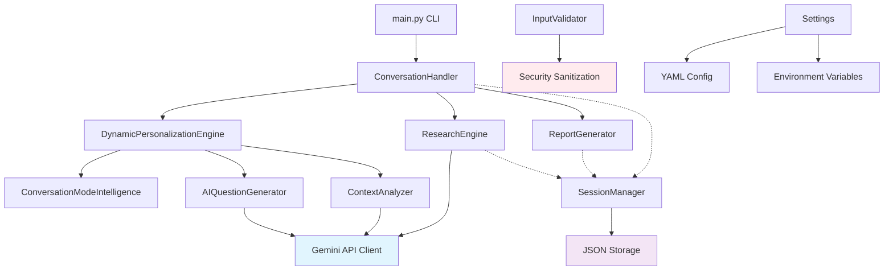
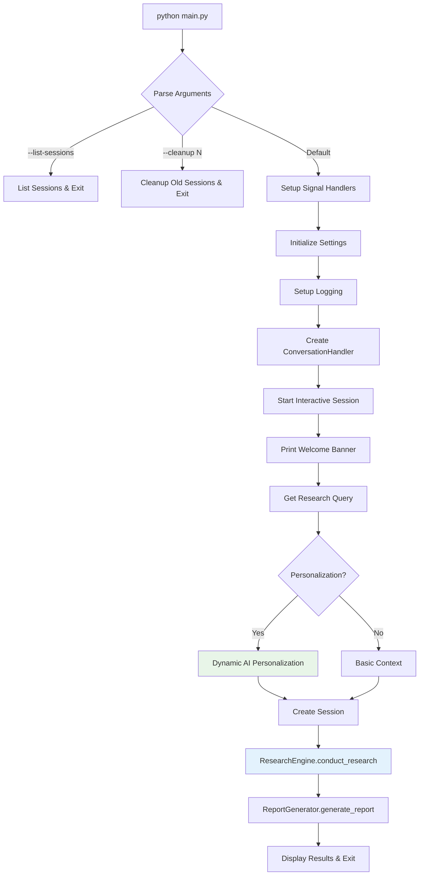
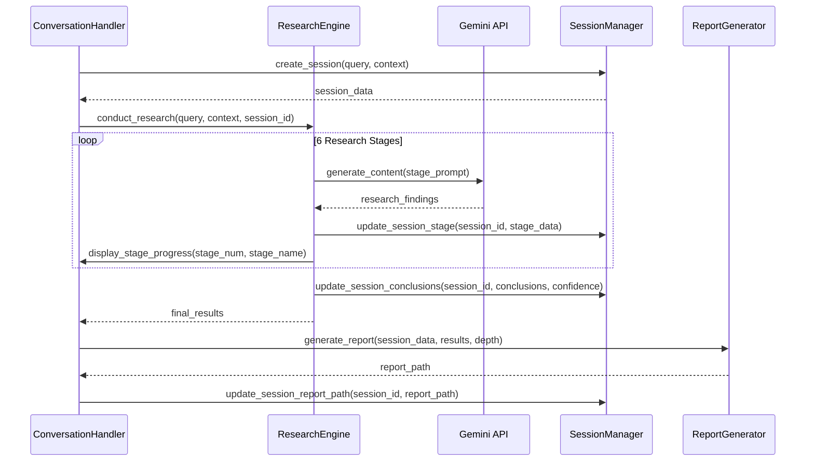

# Deep Research Agent - ProjectSage Analysis

## 1 Project Snapshot

**One-sentence elevator pitch:** A comprehensive AI-powered decision support system that provides universal decision-making assistance through a sophisticated 6-stage iterative research process powered by Google Gemini 2.5 Pro with dynamic personalization.

**Tech stack & major third-party deps:**
- Python 3.9+ with Google Gemini AI API integration
- Core deps: `google-genai`, `python-dotenv`, `pyyaml` 
- Dev/test deps: `pytest`, `pytest-cov`, `black`
- Architecture: Modular OOP with async AI integration patterns

**Directory & module map:**
```
702_gemini_deep_research/
├── main.py                         # CLI entry point & signal handling
├── config/
│   ├── settings.py                 # Configuration management class
│   └── settings.yaml               # YAML config with defaults
├── core/                           # Business logic modules
│   ├── research_engine.py          # 6-stage research orchestrator
│   ├── conversation.py             # User interaction handler
│   ├── report_generator.py         # Markdown report creation
│   ├── dynamic_personalization.py  # AI conversation engine
│   ├── conversation_mode_intelligence.py # Adaptive conversation modes
│   ├── ai_question_generator.py    # Gemini question generation
│   ├── context_analyzer.py         # Response analysis
│   └── conversation_state.py       # State management
├── utils/
│   ├── session_manager.py          # JSON session persistence
│   └── validators.py               # Input sanitization
├── tests/                          # Comprehensive test suite (92 tests)
└── data/
    ├── sessions/                   # Persisted research sessions
    └── reports/                    # Generated markdown reports
```

## 2 Architectural Overview



**Data-flow narrative:** User queries enter through CLI → conversation handler gathers personalization through AI-driven questioning → research engine conducts 6-stage iterative research using Gemini → results synthesized into professional markdown reports → all data persisted in JSON sessions.

**Key design patterns:**
- **Strategy Pattern**: Multiple conversation modes (Quick/Standard/Deep/Adaptive)
- **Observer Pattern**: Real-time progress feedback during research stages
- **Factory Pattern**: Report generation with configurable depth levels
- **Command Pattern**: Modular research stage execution with fallback handling
- **State Machine**: Conversation state management with AI-driven transitions

## 3 Execution Flow Diagrams

### Main CLI Entry Point



### Research Engine Cross-Module Sequence



## 4 Pseudocode

### Core Research Engine Flow
```
function conduct_research(query, context, session_id):
    initialize_research_state(query, context, session_id)
    
    for each stage in [1..6]:
        display_stage_progress(stage.number, stage.name)
        
        try:
            stage_method = get_stage_method(stage.method_name)
            stage_result = stage_method(research_state)
            
            validate_stage_result(stage_result)
            research_state.stages.append(stage_result)
            session_manager.update_session_stage(session_id, stage_result)
            
            sleep(rate_limit_delay)
            
        catch exception:
            log_error(stage.number, exception)
            add_fallback_result(research_state, stage, exception)
    
    confidence_score = calculate_confidence_score(research_state)
    finalize_results(research_state, confidence_score)
    return final_results
```

### Dynamic Personalization Engine
```
function gather_personalization(query, temp_session_id):
    user_signals = mode_intelligence.analyze_user_signals(query)
    mode_recommendation = mode_intelligence.recommend_conversation_mode(user_signals)
    
    conversation_state = initialize_conversation(query, temp_session_id)
    current_mode = mode_recommendation.recommended_mode
    max_questions = get_mode_config(current_mode).max_questions
    
    question_count = 0
    user_responses = []
    
    while question_count < max_questions:
        question = generate_next_question(conversation_state)
        if not question: break
        
        response = ask_user(question)
        if not response: continue
        
        process_user_response(conversation_state, question, response)
        user_responses.append(response)
        
        if question_count >= 2:
            engagement_metrics = monitor_engagement(user_responses)
            should_switch = should_switch_mode(current_mode, engagement_metrics)
            
            if should_switch:
                new_mode = determine_new_mode(current_mode, engagement_metrics)
                transition_between_modes(current_mode, new_mode)
                current_mode = new_mode
        
        question_count++
    
    return convert_conversation_to_context(conversation_state)
```

### Session Management
```
function create_session(query, context):
    validate_query(query)
    validate_context_data(context)
    
    session_id = generate_session_id()  // DRA_YYYYMMDD_HHMMSS_μsec
    
    session_data = {
        session_id: session_id,
        created_at: current_timestamp(),
        query: query,
        context: context,
        research_results: empty_results(),
        status: "created"
    }
    
    save_session_to_file(session_data)
    return session_data
```

### Input Validation & Sanitization
```
function validate_query(query):
    if not is_string(query) or is_empty(query):
        throw ValidationError("Query must be non-empty string")
    
    sanitized = sanitize_string(query, max_length=500)
    
    if length(sanitized) < 5:
        throw ValidationError("Query too short")
    
    if not contains_alphabetic_chars(sanitized):
        throw ValidationError("Query must contain letters")
    
    return sanitized

function sanitize_string(text, max_length):
    text = remove_control_characters(text)
    text = remove_sql_injection_patterns(text)
    text = remove_xss_patterns(text)
    text = remove_command_injection_patterns(text)
    text = remove_dangerous_characters(text)
    return truncate(strip(text), max_length)
```

## 5 Code-Level Walk-through

**AI Integration Pattern** (`core/research_engine.py:99-150`):
- Uses Google Gemini 2.5 with safety settings and retry logic
- Exponential backoff for rate limiting with configurable delays
- Structured JSON response parsing with fallback error handling
- Each stage has dedicated prompt templates optimized for research quality

**Dynamic Conversation Intelligence** (`core/conversation_mode_intelligence.py:90-200`):
- Four adaptive modes: Quick (3q), Standard (6q), Deep (12q), Adaptive (8q)
- Real-time engagement monitoring with metrics-based mode switching
- AI-powered urgency detection and complexity assessment
- Natural conversation flow with context-aware question generation

**Security Implementation** (`utils/validators.py:45-120`):
- Comprehensive input sanitization against SQL injection, XSS, command injection
- Path traversal prevention with project root validation
- Control character filtering and dangerous pattern detection
- Configurable limits with settings-driven validation rules

**Session Persistence** (`utils/session_manager.py:40-90`):
- Atomic JSON operations with secure file permissions (600)
- Graceful degradation for corrupted sessions
- Automatic cleanup of stale/incomplete sessions
- Microsecond-precision session ID generation

**Progressive Research Stages** (`core/research_engine.py:180-350`):
- Stage 1: Broad information gathering with source reliability scoring
- Stage 2: Fact-checking and validation with confidence assessment
- Stage 3: Gap-filling research with targeted follow-up queries
- Stage 4: Systematic comparative analysis with scoring matrices
- Stage 5: Synthesis integration with pattern identification
- Stage 6: Final conclusions with personalized recommendations

## 6 Improvement Radar

### Maintainability
**• Async/Await Integration** - Current sync calls block during AI requests
*Why*: 6-stage research process can take 60+ seconds; blocking UX is poor
*Fix*: Convert Gemini calls to async, add progress indicators, enable cancellation

**• Configuration Hot Reloading** - Settings require restart to take effect
*Why*: Development workflow slowed by constant restarts for config changes  
*Fix*: Add file watcher for settings.yaml, implement reload without restart

**• Error Recovery Strategies** - Limited graceful degradation patterns
*Why*: AI failures cascade to complete research failure vs partial results
*Fix*: Implement research stage checkpointing, resume capability, offline mode

### Performance
**• Response Caching** - No caching of similar queries or AI responses
*Why*: Repeated similar queries waste API calls and user time
*Fix*: Implement semantic similarity caching with TTL, query fingerprinting

**• Parallel Stage Execution** - Sequential 6-stage process is inherently slow
*Why*: Some stages could run concurrently (validation + clarification)
*Fix*: Dependency analysis, async stage orchestration, result merging

**• Memory Optimization** - Full conversation history kept in memory
*Why*: Long conversations consume excessive RAM, no cleanup
*Fix*: Implement conversation state compression, LRU eviction, streaming

### Security  
**• API Key Exposure** - Keys logged in debug mode, stored in plaintext
*Why*: Sensitive credentials visible in logs and config files
*Fix*: Credential masking in logs, encrypted storage, key rotation

**• Injection Vulnerabilities** - Incomplete sanitization in AI prompts
*Why*: User input directly interpolated into AI prompts without escaping
*Fix*: Parameterized prompt templates, output validation, context sandboxing

**• Resource Exhaustion** - No rate limiting on user requests
*Why*: Malicious users could exhaust API quotas or overwhelm system
*Fix*: User-based rate limiting, request queuing, resource monitoring

### API/UX
**• Conversation Recovery** - No ability to resume interrupted conversations
*Why*: Users lose progress if session terminates during personalization
*Fix*: Conversation state persistence, resume prompts, partial result saving

**• Real-time Feedback** - Limited progress indication during long operations
*Why*: Users unsure if system is working during 60+ second research cycles
*Fix*: WebSocket progress events, estimated completion times, cancellation

**• Export Capabilities** - Reports only available as markdown files
*Why*: Users need PDF, DOCX, or structured data formats for sharing
*Fix*: Multi-format export pipeline, template system, print-friendly CSS

### LLM-friendliness
**• Code Documentation** - Inconsistent docstring patterns across modules
*Why*: AI code assistants struggle with inconsistent documentation styles
*Fix*: Standardize to Google/NumPy docstring format, add type hints

**• Prompt Engineering** - Hard-coded prompts scattered throughout codebase
*Why*: Difficult for AI to suggest prompt improvements or variations
*Fix*: Centralized prompt template system, version control, A/B testing

**• Function Granularity** - Some methods exceed 100 lines, complex logic
*Why*: AI cannot easily understand or suggest improvements to large functions
*Fix*: Single responsibility refactoring, pure function extraction

## 7 Ready-Made Follow-Up Prompts

| **Category** | **Prompt** | **Expected Output** |
|--------------|------------|-------------------|
| **Feature Development** | "Add a new conversation mode called 'Expert' that skips basic questions and focuses on advanced criteria for users with domain expertise." | Implementation in conversation_mode_intelligence.py with new mode config |
| **Performance Optimization** | "Implement response caching for similar queries using semantic similarity matching to reduce API calls by 40%." | Caching layer in research_engine.py with similarity threshold settings |
| **Security Enhancement** | "Add input validation for AI prompt injection attacks where users try to manipulate the research direction through crafted queries." | Enhanced sanitization in validators.py with prompt injection detection |
| **Export Feature** | "Create a PDF export option for reports with professional formatting, charts, and company branding support." | New export module with PDF generation pipeline |
| **API Integration** | "Add support for OpenAI GPT models as an alternative to Gemini with automatic fallback capability." | AI abstraction layer with multi-provider support |
| **Analytics** | "Implement usage analytics to track conversation effectiveness, user satisfaction, and research quality metrics." | Analytics module with privacy-compliant data collection |
| **Testing Enhancement** | "Create integration tests that use a mock AI service to test the complete research flow without API costs." | Mock service implementation and comprehensive flow tests |
| **Configuration** | "Add a web-based configuration UI for non-technical users to adjust research parameters and conversation settings." | Web interface for settings management |

## 8 Appendix

### Glossary of Domain Terms

**• Conversation State** - Persistent object tracking user profile, question history, and AI-discovered insights throughout personalization
**• Research Stage** - One of six sequential analysis phases: gathering, validation, clarification, comparison, synthesis, conclusions  
**• Dynamic Personalization** - AI-driven adaptive questioning that discovers user priorities without predefined categories
**• Conversation Mode** - Interaction style (Quick/Standard/Deep/Adaptive) that adjusts question depth and pace
**• Session Manager** - Component handling JSON persistence of complete research sessions with unique identifiers
**• Confidence Scoring** - 0.0-1.0 metric indicating research quality based on evidence strength and source reliability

### External Resources Worth Reading
- [Google Gemini API Documentation](https://ai.google.dev/docs) - Integration patterns and safety settings
- [Pytest Best Practices](https://docs.pytest.org/en/stable/) - Test organization with custom markers
- [Python Security Guide](https://python-security.readthedocs.io/) - Input validation and sanitization patterns
- [Conversational AI Design](https://conversational-ai.io/) - User experience patterns for AI dialogue systems

### Open Questions & Ambiguous Parts

**TODO: Research Engine Stage Dependencies** - Unclear if stages 2-3 could run in parallel, dependency analysis needed

**TODO: Conversation Mode Thresholds** - Magic numbers for engagement metrics (response_length > 20 = "high") need validation

**TODO: API Rate Limiting** - No documentation on Gemini rate limits or quota management strategy  

**TODO: Error Recovery** - Partial research results handling when stages 4-6 fail is inconsistent

**TODO: Session Cleanup Logic** - 24-hour threshold for "stale" sessions seems arbitrary, needs user research

**TODO: Memory Management** - No analysis of memory usage patterns for long conversations or large result sets

---
*Analysis completed by ProjectSage - designed to provide technical teams with actionable insights for codebase evolution.*
